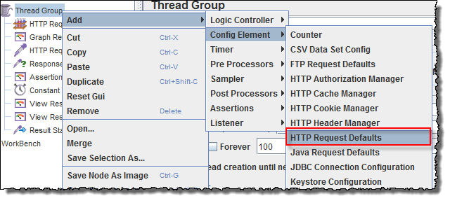
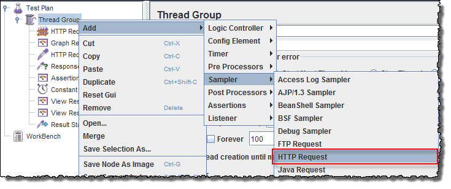
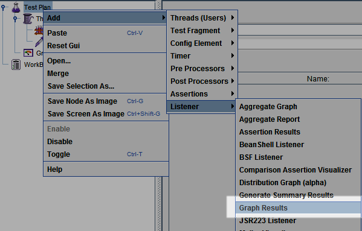
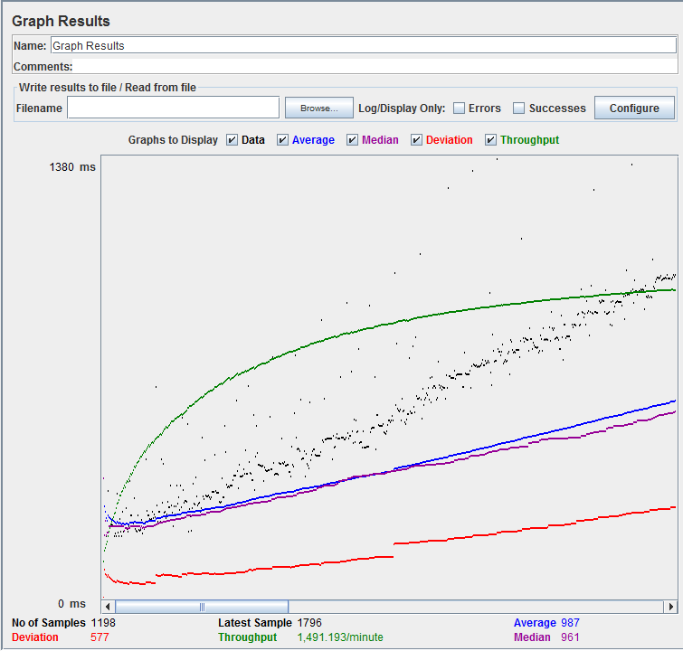

# Load Tests
In this exercise, you will learn how to create a simple performance test based on HTTP protocol using JMeter application. 
JMeter is open-source application designed to load test, functional behaviour and measure performance.

## Exercise
Perform a simple load test google calendar. This tutorial is from
https://www.guru99.com/jmeter-performance-testing.html

### Steps
1. From https://jmeter.apache.org/ download and install JMeter. 
2. Run JMeter.
3. Select and right click on Test Plan. Select Add -> Threads -> Thread Group. 

4. In the Thread Group control panel, enter Thread Properties as follows:

* Number of Threads - number of users connects to the target website
* Loop Count - number of time to execute testing
* Ramp-Up Period - how long to delay before starting the next user. For example, 
		   if we have 100 users and a 100-second Ramp-Up period, then the 
	           delay between starting users would be 1 second (100 seconds /100 users) 

5. Select and right click on Thread Group. Select Add -> Config Element -> HTTP Request Defaults

In the HTTP Request Defaults control panel, enter the Website name: www.google.com. 
The main goals of using the HTTP Default Request is to:
	a) Avoid data duplication in tests.
	b) Make test scripts more (easily) maintainable.

Now you can avoid providing website name in every request.

6. Select and right click on Thread Group. Select Add -> Sampler -> HTTP Request.

In HTTP Request Control Panel, the Path field indicates which URL request you want to send to Google server. 
If you keep the Path field blank JMeter will create the URL request http://www.google.com to Google server. 
In this test enter calendar in Path field. JMeter JMeter will create the URL request http://www.google.com/calendar

7. Select and right click on Thread Group. Select Add -> Listener -> Graph Results

* Black: The total number of current samples sent.
* Blue: The current average of all samples sent.
* Red: The current standard deviation.
* Green: Throughput rate that represents the number of requests per minute the server handled

8. Press the Run button (Ctrl + R) on the Toolbar to start the software testing process.

To analyze the performance of the web server under test, you should focus on 2 parameters:
* Throughput
* Deviation

The Throughput is the most important parameter. It represents the ability of the server to handle a heavy load. The higher the Throughput is, the better is the server performance.

In this test, the throughput of Google server is 1,491.193/minute. It means Google server can handle 1,491.193 requests per minute. This value is quite high so we can conclude that Google server has good performance

The deviation is shown in red - it indicates the deviation from the average. The smaller the better.

## Assignment
Your task will be to write load tests for the rss application. 

### Requirements
* Write all supported HTTP requests your application.
* Measure the throughput, deviation, latency and sample time.
* Measure how many users your application can handle without scaling.
* Create JMeter report with your analysis.

### Hints
* You will need add other type of listener to calculate latency.
* The maximum server load can be determined by response times and response errors.
* Measuring maximum server load is tricky. If you can't estimate it, describe in the report why and how it should be done.

Create a JMeter report and analysis of this report in a separate MD file. Link JMeter report with analyze the file and add it in the repo of your application in newly created folder docs.